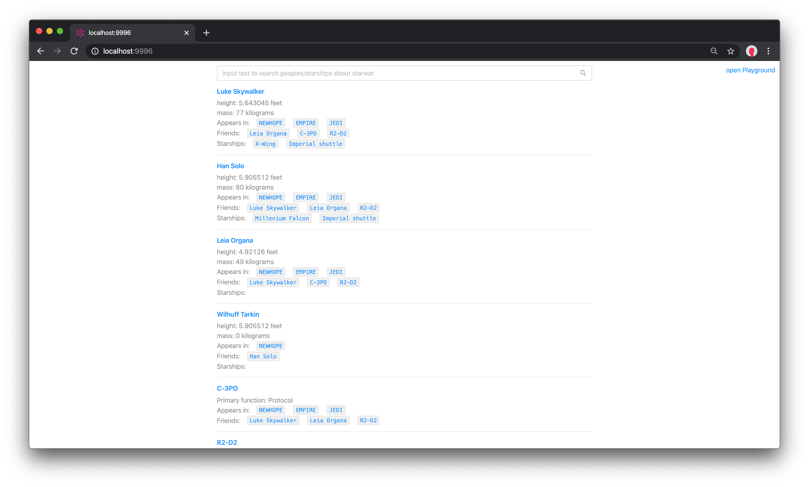
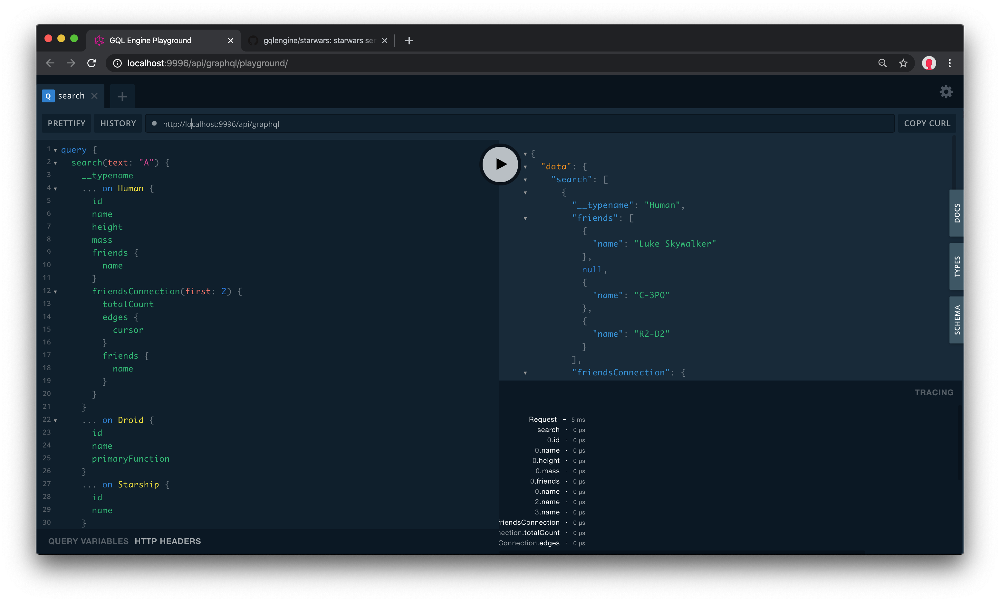

# starwars implemented by gqlengine


starwars is a classic example for graphql server, here's a gqlengine version of it with playground in side.


run by `go get`

```
go get github.com/gqlengine/starwars@master
```


after run, open http://localhost:9996 you will get this:



open http://localhost:9996/api/graphql/playground you will get this:





enjoy to play with the demo!